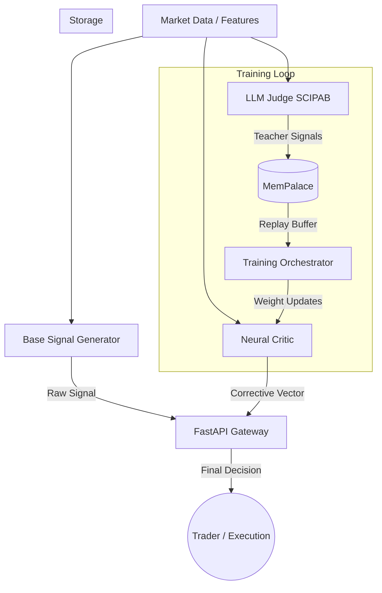
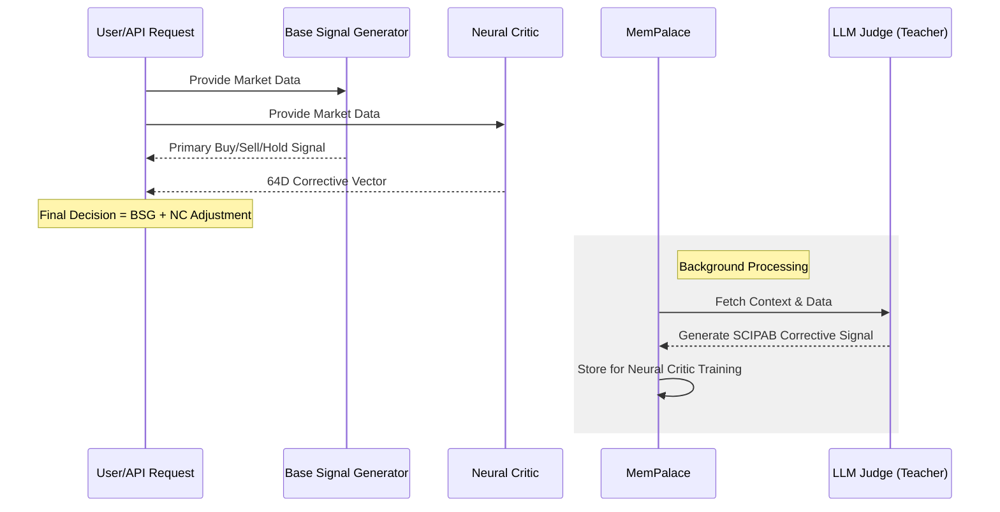

# OpenMnemosyne

OpenMnemosyne is a hybrid LLM-supervised trading signal system featuring a Base Signal Generator, a fast Neural Critic, and an LLM-based teacher (Judge) using the SCIPAB framework. This system is designed to address the problem of generalization and out-of-distribution learning in AI models. It used LLM to supervise, correct and contain model trained on stock technicals using SCIPAB framework over stock fundamentals. 

## Problem it tries to solve: Generalization & out-of-distribution learning (Not a complete solution)

### Why it matters: real-world deployment

### Models often fail when conditions shift slightly from training data.  

### What’s unsolved
	•	Learning causal structure instead of correlations
	•	Reliable performance in unseen environments
	•	Transfer learning that works across domains

### Human impact
	•	AI that works globally (not just on curated datasets)
	•	Climate models that generalize across regions
	•	Medical models that work across populations


## System Architecture



## Inference Sequence



## Correction & Training Loop

The system operates on a "Teacher-Student" paradigm where the LLM (Teacher) supervises the Neural Critic (Student).

### 1. Corrective Signal Logic
The Neural Critic generates a **64-dimensional corrective vector** that modifies the Base Signal. This includes:
- **Deltas**: Adjustments to probabilities and position sizes.
- **Sanity Scores**: Risk assessments (macro, tail, liquidity).
- **Alignment**: How well the technical signal aligns with fundamental/sentiment context.

### 2. Training Phases
- **Supervised Phase (Bootstrapping)**:
  Initially, the Neural Critic is cold-started by training it to minimize the MSE between its output and the high-fidelity signals generated by the LLM Judge. The LLM Judge uses the SCIPAB framework to provide deep qualitative-to-quantitative corrections.
  
- **Reinforcement Learning Phase (PPO)**:
  Once bootstrapped, the system transitions to fine-tuning via PPO. The reward function combines:
  - Realized market returns (PnL).
  - Risk-adjusted metrics (Downside deviation).
  - **Sanity Bonus**: Reward for the Critic correctly identifying high-risk scenarios flagged by the LLM or subsequent market volatility.

## Project Structure
- `src/api/`: FastAPI gateway for inference.
- `src/models/`: Neural Critic (MLP-Mixer + Transformer) and Base Signal Generator.
- `src/services/`: LLM Judge (SCIPAB) and MemPalace (Hybrid Memory).
- `src/orchestrator/`: Training logic (Supervised + PPO RL).
- `src/schemas/`: Pydantic V2 data models.
- `src/config/`: System settings and reward weights.

## How to Run
1. Ensure you have Docker and Docker Compose installed.
2. Set your `LLM_API_KEY` in the environment.
3. Start the system (default is CPU mode for compatibility):
   ```bash
   docker-compose up --build
   ```

### GPU Support
If you have an NVIDIA GPU and the [NVIDIA Container Toolkit](https://docs.nvidia.com/datacenter/cloud-native/container-toolkit/install-guide.html) installed:
1. Uncomment the `deploy` sections in `docker-compose.yml`.
2. Set `USE_CUDA=true` in the environment variables within `docker-compose.yml`.

If you see the error `could not select device driver "nvidia"`, it means your Docker environment is not configured for NVIDIA GPUs. The system will default to CPU if you keep the `deploy` section commented out.

## Bootstrapping the Neural Critic
The system uses a two-stage training approach:
1. **Supervised Phase**: The Neural Critic is trained to mimic the 64D corrective vector produced by the LLM Judge using the `LLMJudgeService`.
2. **RL Phase (PPO)**: Once bootstrapped, the Neural Critic is fine-tuned using Proximal Policy Optimization based on market returns and sanity bonuses.

## Daily vs Intraday Mode
- Switch modes by adjusting the `TIMEFRAME` parameter in API requests.
- The `NeuralCritic` architecture supports varying sequence lengths via its Transformer encoder, allowing it to adapt to different data granularities.

## Real-Life Use Cases

OpenMnemosyne's hybrid architecture makes it suitable for various high-stakes trading environments. Below are detailed scenarios demonstrating how the system provides value:

### 1. Hedge Fund Alpha Generation (Fundamental Overlay)
Large-scale funds use the **Base Signal Generator** to process high-frequency technical data across thousands of symbols. The **LLM Judge** acts as a senior analyst, ingesting non-quantifiable data like earnings call transcripts and central bank speeches.

*   **Example Scenario**: A technical breakout (Base Signal: `BUY`) occurs on a regional bank stock. However, the LLM Judge identifies systemic liquidity stress mentioned in recent Fed minutes stored in **MemPalace**.
*   **Critic Action**: The Neural Critic generates a corrective vector with a high `liquidity_risk` (0.85) and negative `buy_prob_delta` (-0.4), effectively neutralizing the trade.
*   **Result**: The fund avoids a "bull trap" caused by macro factors invisible to technical models.

### 2. Retail Algo-Trading (Intelligent Safety Net)
Individual traders often struggle with "market regime shifts" where their backtested strategies fail. OpenMnemosyne provides a plug-and-play **sanity layer**.

*   **Example Scenario**: A retail trend-following strategy signals a `BUY` on a volatile tech stock during an after-hours earnings announcement. 
*   **Critic Action**: The Neural Critic detects a `sentiment_shock` (0.92) due to the high-variance LLM analysis of the earnings surprise vs. guidance. It sets `position_size_delta` to -70%.
*   **Result**: The trader stays in the trade but with significantly reduced exposure, protecting capital against the extreme volatility that follows.

### 3. Institutional Risk Management (Portfolio Health Monitor)
Risk desks use the system not for signal generation, but for **continuous diagnostic monitoring** of existing positions.

*   **Example Scenario**: A desk holds a large position in an energy company. The market is stable, but a geopolitical event (e.g., pipeline disruption) is flagged by the LLM Judge.
*   **Critic Action**: The `tail_risk` score in the 64D vector spikes from 0.05 to 0.78. The `overall_sanity_score` drops to 0.3.
*   **Result**: The risk management dashboard triggers an automated alert. The desk can hedge the position with options before the technical indicators even reflect the new risk profile.

### 4. Crypto Volatility Trading (Flash Crash Prevention)
In crypto, liquidity can vanish in seconds. The **MemPalace** stores "fingerprints" of past liquidity drains and flash crashes.

*   **Example Scenario**: A momentum bot sees a `BUY` signal on a mid-cap altcoin.
*   **Critic Action**: The Neural Critic retrieves a similar pattern from MemPalace associated with a previous "rug pull" or liquidity drain. It flags `macro_risk` and `liquidity_risk` as critical.
*   **Result**: The system blocks the trade (`final_decision: HOLD`) despite the bullish technical indicators, saving the portfolio from a 20% slippage event.

## Suggested Features & Roadmap

### Phase 1: Foundation (Current)
- [x] Modular architecture with Docker support.
- [x] Hybrid Neural Critic (MLP-Mixer + Transformer).
- [x] SCIPAB-structured LLM supervision.
- [x] Basic PPO Reinforcement Learning skeleton.

### Phase 2: Enhanced Intelligence (Short-term)
- **Multi-Agent Debate**: Implement a "Committee of Judges" where multiple LLMs (e.g., GPT-4, Claude 3, and a local Llama-3) debate the trade before updating the MemPalace.
- **Hierarchical RL**: Add a higher-level agent to manage global portfolio heat and sector exposure based on individual ticker corrections.
- **Live Data Connectors**: Built-in adapters for Alpaca, Interactive Brokers, and Binance.

### Phase 3: Advanced Memory & Scaling (Mid-term)
- **Distributed Training**: Integration with **Ray** or **PyTorch Distributed** to handle massive bootstrapping sessions.
- **Knowledge Graph Integration**: Upgrade MemPalace to include a Knowledge Graph (e.g., FalkorDB) to map supply chain relationships between companies.
- **Cross-Asset Correlation**: Expand the 64D vector to include correlations with indices (S&P 500, DXY) and commodities (Gold, Oil).

### Phase 4: Production Maturity (Long-term)
- **Self-Healing Infrastructure**: Automatic retraining triggers when the "Critic Alignment" score drops below a threshold for extended periods.
- **Web Dashboard**: A real-time monitoring UI to visualize the Base Signal vs. Critic Correction in a unified "Decision Canvas."
- **Institutional Compliance**: Audit logs that store the exact SCIPAB reasoning for every major correction for regulatory reporting.
