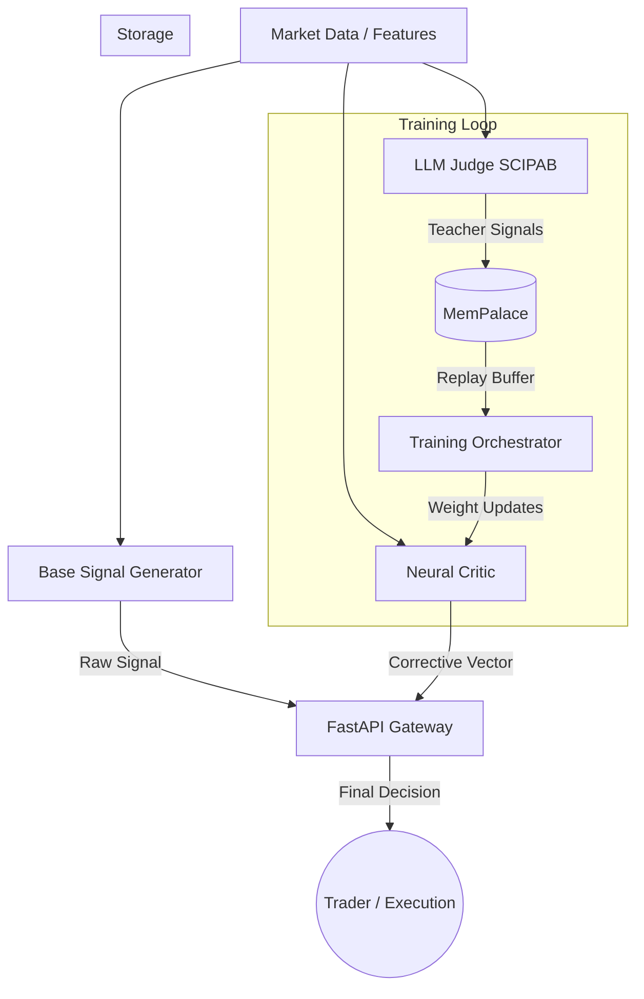
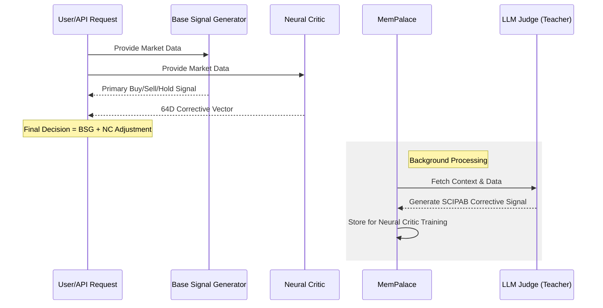

# OpenMnemosyne

OpenMnemosyne is a hybrid LLM-supervised trading signal system featuring a Base Signal Generator, a fast Neural Critic, and an LLM-based teacher (Judge) using the SCIPAB framework.

## System Architecture



## Inference Sequence



## Correction & Training Loop

The system operates on a "Teacher-Student" paradigm where the LLM (Teacher) supervises the Neural Critic (Student).

### 1. Corrective Signal Logic
The Neural Critic generates a **64-dimensional corrective vector** that modifies the Base Signal. This includes:
- **Deltas**: Adjustments to probabilities and position sizes.
- **Sanity Scores**: Risk assessments (macro, tail, liquidity).
- **Alignment**: How well the technical signal aligns with fundamental/sentiment context.

### 2. Training Phases
- **Supervised Phase (Bootstrapping)**:
  Initially, the Neural Critic is cold-started by training it to minimize the MSE between its output and the high-fidelity signals generated by the LLM Judge. The LLM Judge uses the SCIPAB framework to provide deep qualitative-to-quantitative corrections.
  
- **Reinforcement Learning Phase (PPO)**:
  Once bootstrapped, the system transitions to fine-tuning via PPO. The reward function combines:
  - Realized market returns (PnL).
  - Risk-adjusted metrics (Downside deviation).
  - **Sanity Bonus**: Reward for the Critic correctly identifying high-risk scenarios flagged by the LLM or subsequent market volatility.

## Project Structure
- `src/api/`: FastAPI gateway for inference.
- `src/models/`: Neural Critic (MLP-Mixer + Transformer) and Base Signal Generator.
- `src/services/`: LLM Judge (SCIPAB) and MemPalace (Hybrid Memory).
- `src/orchestrator/`: Training logic (Supervised + PPO RL).
- `src/schemas/`: Pydantic V2 data models.
- `src/config/`: System settings and reward weights.

## How to Run
1. Ensure you have Docker and Docker Compose installed.
2. Set your `LLM_API_KEY` in the environment.
3. Start the system:
   ```bash
   docker-compose up --build
   ```

## Bootstrapping the Neural Critic
The system uses a two-stage training approach:
1. **Supervised Phase**: The Neural Critic is trained to mimic the 64D corrective vector produced by the LLM Judge using the `LLMJudgeService`.
2. **RL Phase (PPO)**: Once bootstrapped, the Neural Critic is fine-tuned using Proximal Policy Optimization based on market returns and sanity bonuses.

## Daily vs Intraday Mode
- Switch modes by adjusting the `TIMEFRAME` parameter in API requests.
- The `NeuralCritic` architecture supports varying sequence lengths via its Transformer encoder, allowing it to adapt to different data granularities.

## Future Roadmap
- Integration with live brokerage APIs (Interactive Brokers/Binance).
- Implementation of Hierarchical Reinforcement Learning for position management.
- Multi-agent debate between multiple LLM Judges to reduce bias.
- Distributed training support via Ray.
